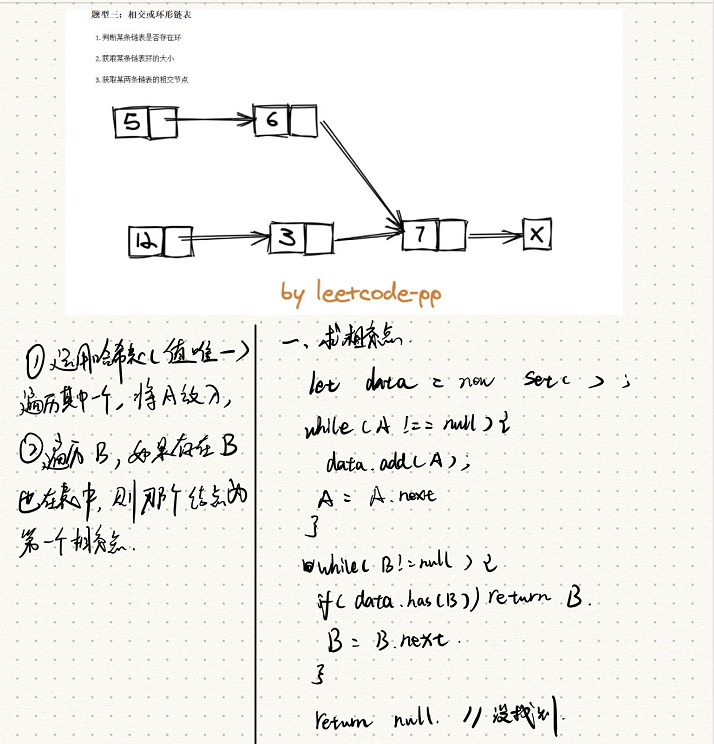

## 题目描述
---
给你两个单链表的头节点 headA 和 headB ，请你找出并返回两个单链表相交的起始节点。如果两个链表没有交点，返回 null 。


[原题地址](https://leetcode-cn.com/problems/intersection-of-two-linked-lists/)

## 思路与想法
---

1. 运用哈希表（值必须唯一）遍历其中一个链表，将其放入哈希表中
2. 此时遍历判断另一个链表，如若存在且等于另一个链表里的某个值，则这个值为相交链表


## 代码  
---

```javascript
 let newList = new ListNode()
    let now = newList
    while(l1!==null&&l2!==null){
        if(l1.val<l2.val){
            now.next = l1
            l1 = l1.next
        }else{
            now.next = l2
            l2 = l2.next
        }
      now = now.next
    }
    if(l1===null){
        now.next = l2
    }else{
        now.next = l1
    }
      return newList.next

```

## 复杂度分析
---
- 时间复杂度：O(n+m)
- 空间复杂度：O(n+m)
