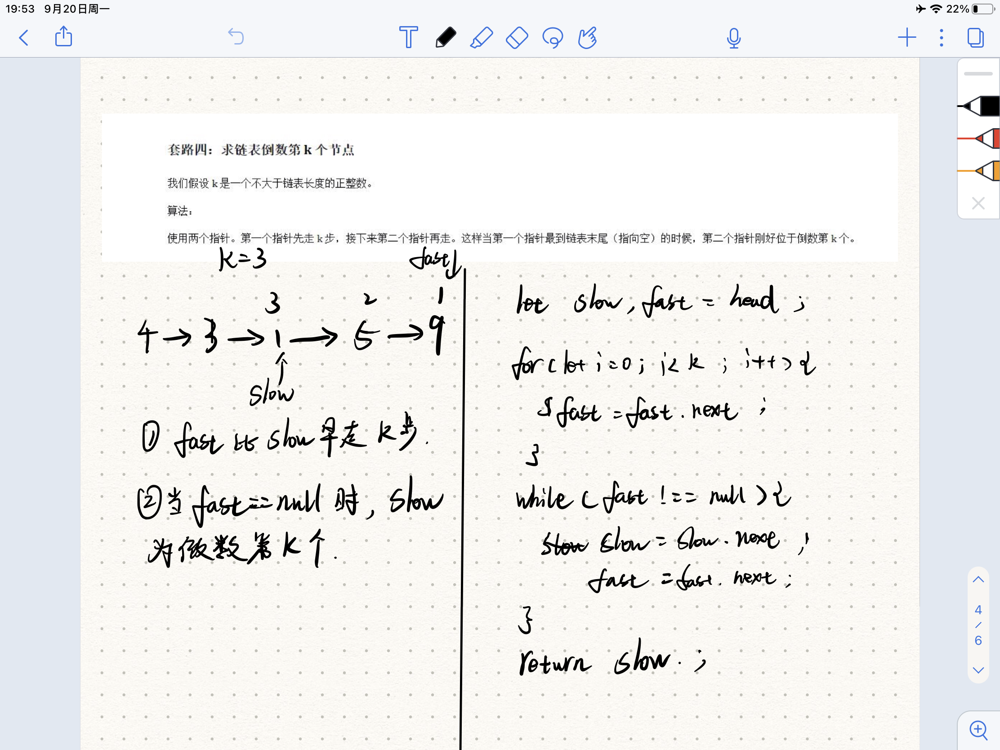

## 题目描述
---

[原题地址](https://leetcode-cn.com/problems/lian-biao-zhong-dao-shu-di-kge-jie-dian-lcof/)

## 思路与想法
---


## 代码  
---

```javascript
    let fast = head;
    let slow = head;

    for(let i=0;i<k;i++){
        fast = fast.next;
    }
    while(fast!==null){
        fast = fast.next;
        slow = slow.next;
    }
    return slow;

```

## 复杂度分析
---
- 时间复杂度：O(n)，其中 nn 为链表的长度。我们使用快慢指针，只需要一次遍历即可，复杂度为 O(n)。

 - 空间复杂度：O(1)。


