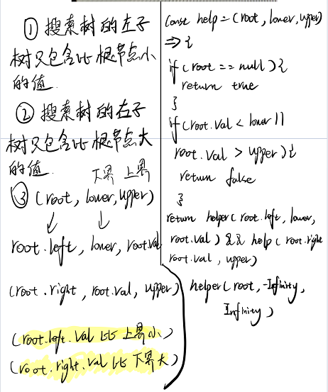

## 题目描述
给你一个二叉树的根节点 root ，判断其是否是一个有效的二叉搜索树。

有效 二叉搜索树定义如下：

节点的左子树只包含 小于 当前节点的数。
节点的右子树只包含 大于 当前节点的数。
所有左子树和右子树自身必须也是二叉搜索树。


[原题地址](https://leetcode-cn.com/problems/validate-binary-search-tree/)

## 思路与想法




## 代码  


```javascript
const helper = (root, lower, upper) => {
    if (root === null) {
        return true;
    }
    if (root.val <= lower || root.val >= upper) {
        return false;
    }
    return helper(root.left, lower, root.val) && helper(root.right, root.val, upper);
}
var isValidBST = function(root) {
    return helper(root, -Infinity, Infinity);
};

```

## 复杂度分析

- 时间复杂度：O(n),其中n为节点个数
- 空间复杂度：O(n),其中n为二叉树的节点个数