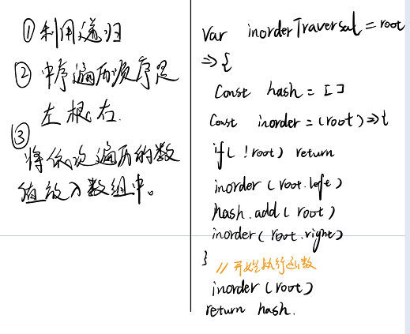

## 题目描述
给定一个二叉树的根节点 root ，返回它的 中序 遍历。


[原题地址](https://leetcode-cn.com/problems/binary-tree-inorder-traversal/)

## 思路与想法




## 代码  


```javascript
    const hash = [];
    const inOrder = (root)=>{
        if(!root) return
        inOrder(root.left)
        hash.push(root.val)
        inOrder(root.right)
    }
   inOrder(root)
   return hash
```

## 复杂度分析

- 时间复杂度：O(n),其中 nn 为二叉树节点的个数
- 空间复杂度：O(n),空间复杂度取决于递归的栈深度